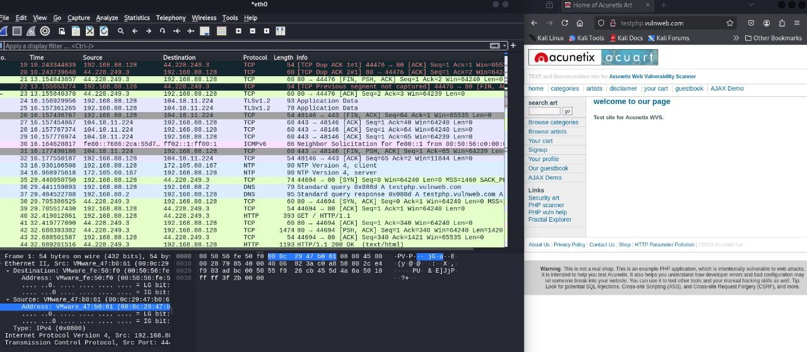
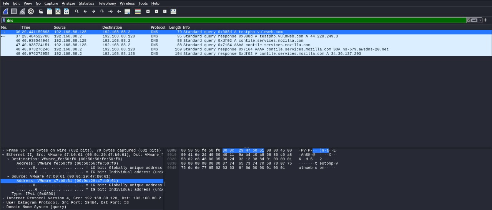
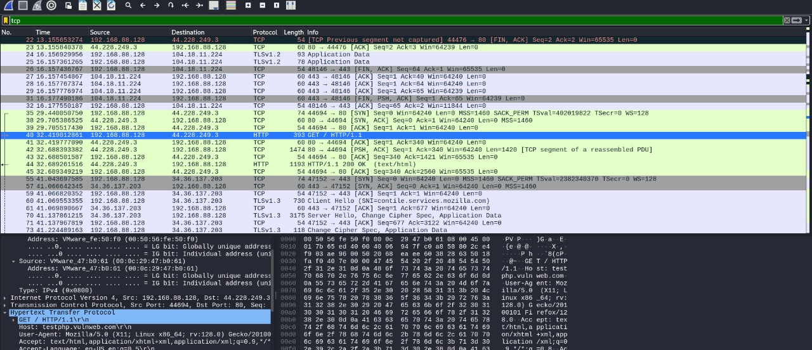
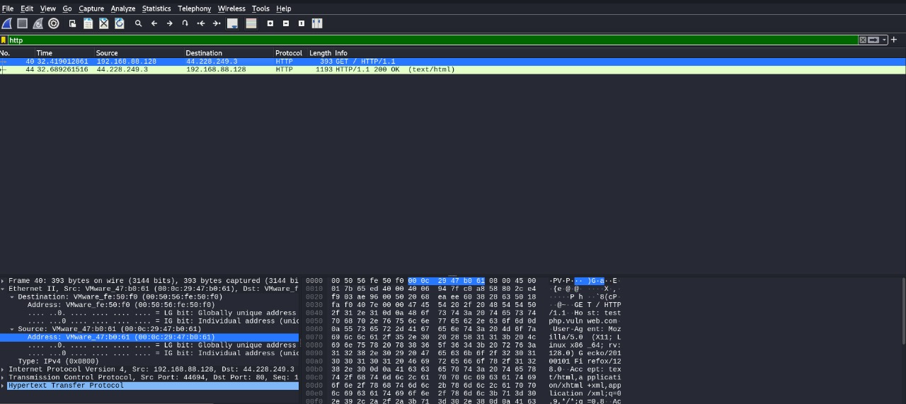

# Wireshark-traffic-analysis
Live traffic capture and protocol analysis using Wireshark

# 🔍 Network Protocol Analysis using Wireshark

## 📌 Objective
Capture live network packets and identify basic protocols and traffic types using Wireshark.

---

## 🛠️ Tools Used
- **Wireshark**
- **Browser / Ping Command**
- **Operating System**: Kali Linux (or your OS)

---

## 📡 Steps Followed

1. Installed Wireshark.
2. Started capture on the active network interface (`eth0` in my case).
3. Browsed a website (`testphp.vulnweb.com`) to generate traffic.
4. Stopped the capture after ~1 minute.
5. Filtered traffic using:
   - `http`
   - `dns`
   - `tcp`
6. Exported the capture as a `.pcap` file.

---

## 📦 Protocols Identified

| Protocol | Description | Example |
|----------|-------------|---------|
| **DNS**  | Resolves domain names to IP addresses | Request to resolve `testphp.vulnweb.com` |
| **TCP**  | Manages reliable data transfer | TCP 3-way handshake (SYN, SYN-ACK, ACK) |
| **HTTP** | Transfers website data | GET request and 200 OK response |

---

## 🖼️ Screenshots

### 🔹 Full Traffic Overview  
Captured during browsing `testphp.vulnweb.com` on Mozilla  

### 🔹 DNS Filter  
Filtered with `dns` to view DNS requests  

### 🔹 TCP Filter  
Filtered with `tcp` to view TCP packet exchange  

### 🔹 HTTP Filter  
Filtered with `http` to inspect HTTP requests/responses  

---

## 📁 Files Included

- [`capture.pcap`](./wireshark_report.pcap) — The exported packet capture
- [`README.md`](./README.md) — Documentation and analysis report
- `/screenshots/` — Directory containing protocol-specific screenshots

---

